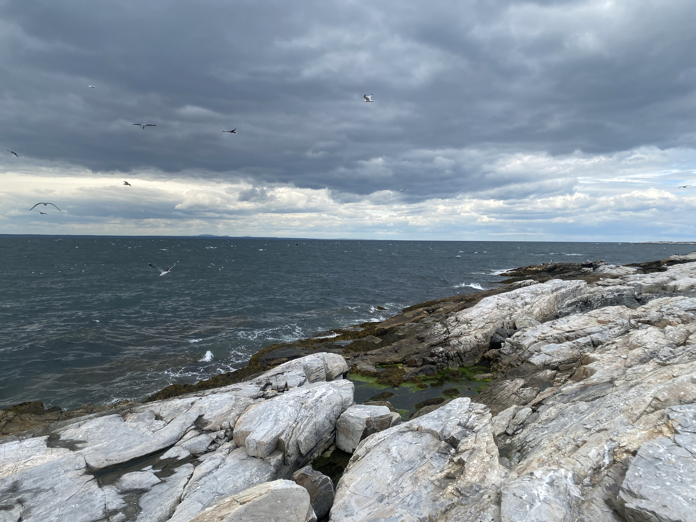
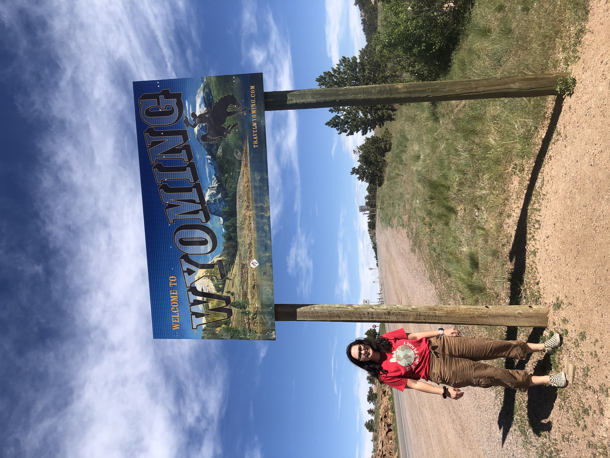

## PhD Research
Featuring pictures of places I've traveled to during my PhD to conduct field work, complete research, or attend conferences or workshops. 

::: {layout="[[1, 1], [1, 1]]"}
{width=400}{group="research"
description="Preserved Bivalve Tissues in the Shellfish Pathology Lab"}

{width=400}{group="research"
description="My lab is located on Nahant, north of Boston in Massachusetts Bay."}

{width=400}{group="research"
description="This site near UNCW is included in my population genomics study."}

{width=400}{group="research"
description="A tour of NMMNH's malacology collection during the Evolution 2023 conference."}

:::

::: {layout="[[1, 1]]"}
{width=400}{group="research"
description="Sea stars I collected near Kosterhavets National Park for the Ocean Genome Legacy Biorepository."}

{width=400}

:::

::: {layout="[[1, 1]]"}

{width=400}

{width=400}

:::

{width=400}

## Travel and Outdoors
### New England
I love to travel regionally from Boston for camping and hiking. Some of my favorite places are the White Mountains in New Hampshire, coastal New England, and the Berkshires in western MA, where I went to undergrad. 
::: {layout="[[1, 1]]"}

{width=400}

{width=400}

:::

### Southwest and Rocky Mountains
I traveled to many of these places during my gap year after finishing undergrad. Although COVID disrupted regular travel, I was able to drive extensively across the region for camping and hiking while remotely working. 

::: {layout="[[1, 1], [1, 1]]"}
{width=400}{group="travel"
description="Arches National Park - Utah"}

{width=400}{group="travel"
description="Colorado National Monument - Grand Junction"}

{width=400}{group="travel"
description="Hoodoos"}

{width=400}{group="travel"
description="Driving north to Wyoming via Colorado"}

:::

## Home
I am currently located in Boston for my PhD. I'm originally from south-central Pennsylvania, and I enjoy spending time in South Carolina with family too. 

