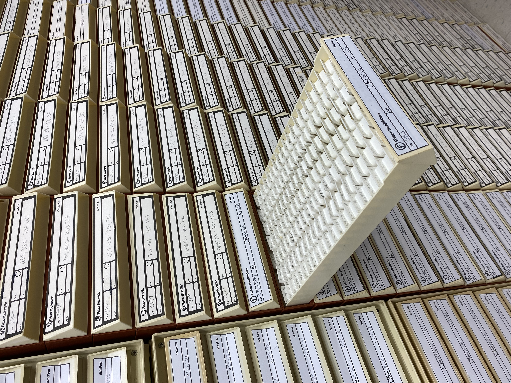
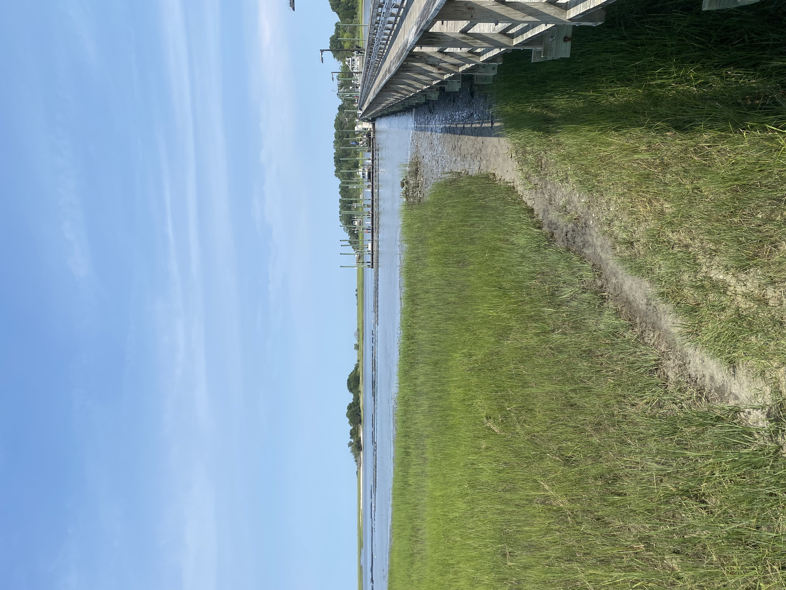
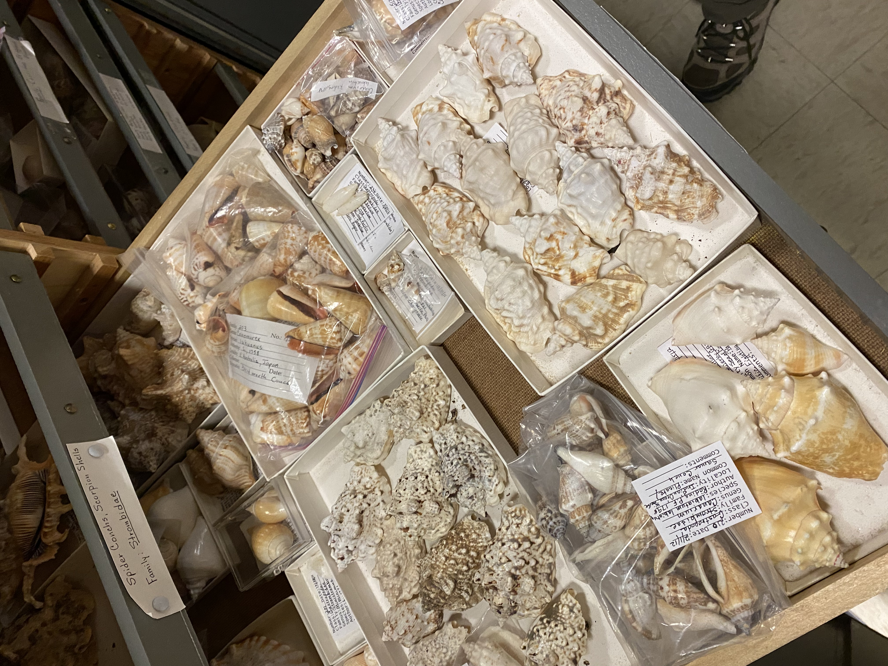
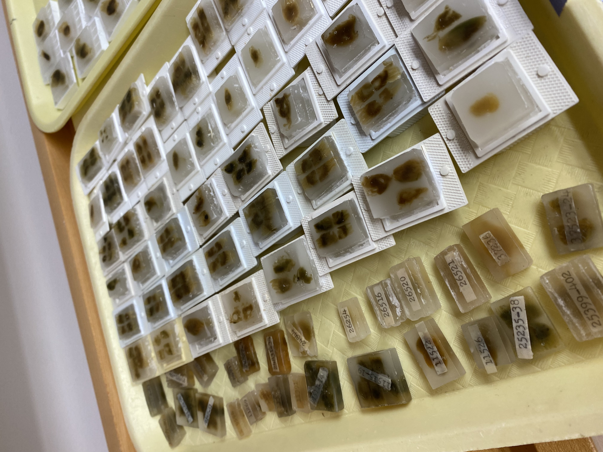
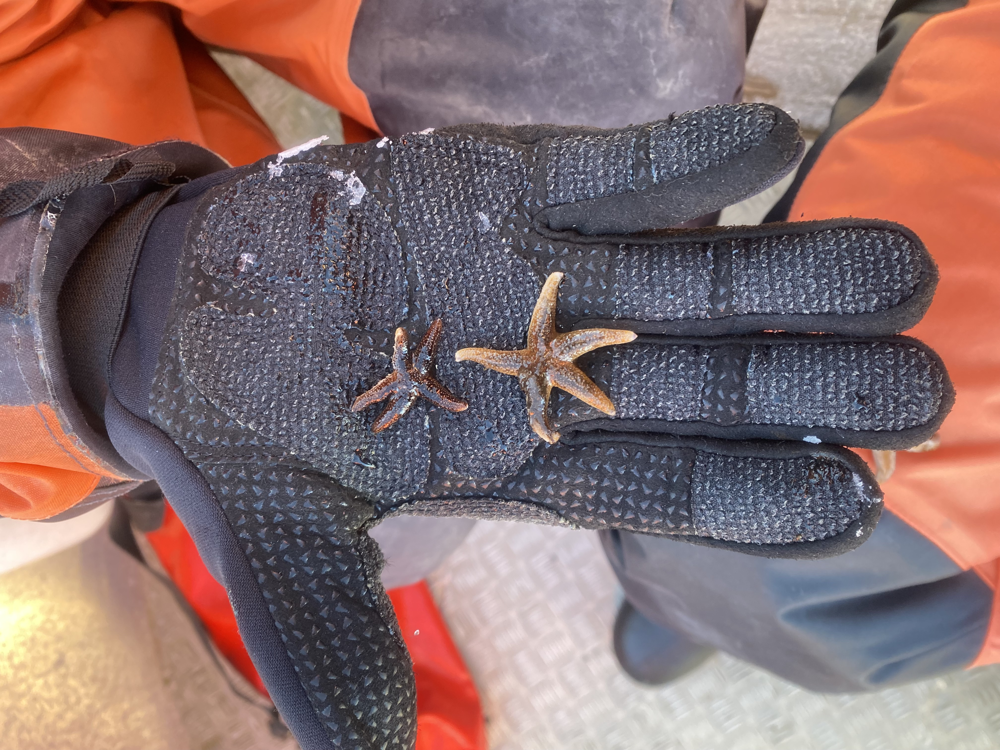
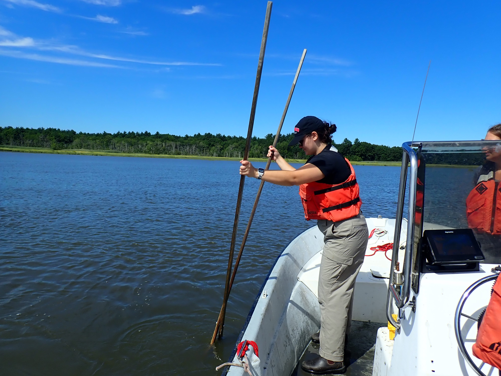
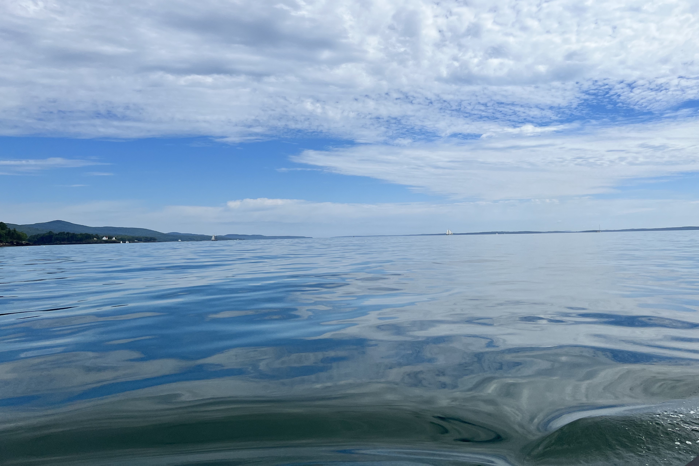
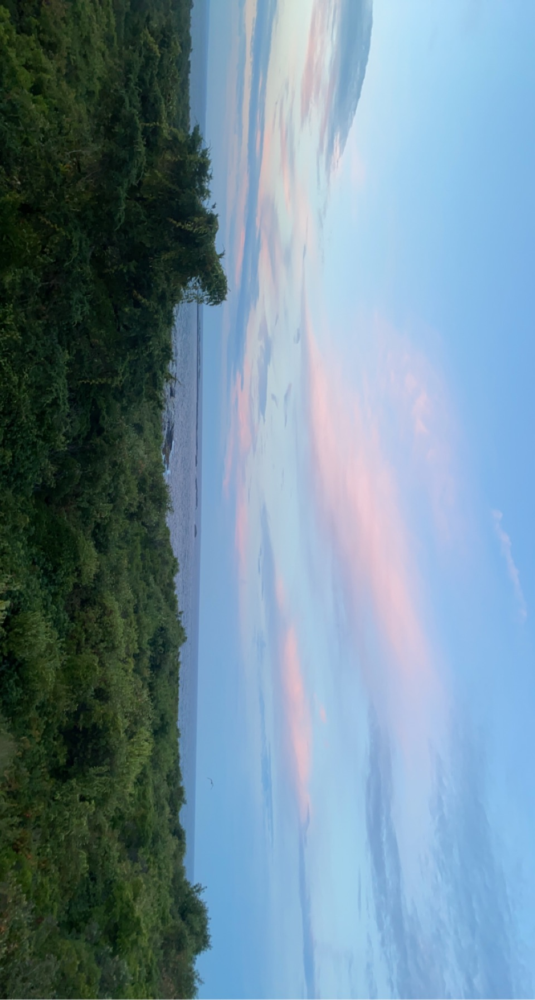

## My Research

::: {layout="[[1, 1], [1]]"}
{group="research"}

{group="research"}

{group="research"}

:::

::: {layout="[[1, 1], [1]]"}

{group="research"}

{group="research"}

{group="research"}

::: {layout="[[1, 1], [1]]"}

{group="research"}

{group="research"}

{group="research"}

:::
