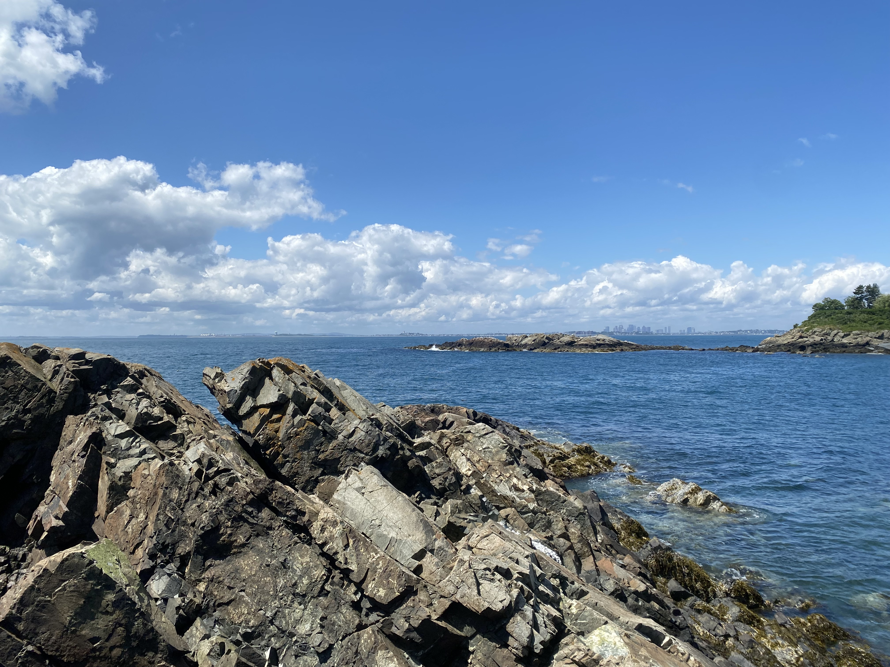

::: column-page-right
Hi! I'm Madeline, welcome to my website. I'm currently pursing a PhD in Marine and Environmental Science at [Northeastern University](https://cos.northeastern.edu/marinescience/) in the Lotterhos Lab. 

For my PhD, I am integrating population genomics approaches, mined environmental data, disease records, and historic museum DNA to reveal evolution of wild eastern oyster populations over space and time. 

I have keen interests in seascape genomics, museomics and natural history, disease and host-parasite interactions, and enviornmental change in marine ecosystems. My ultimate goal is to use 'omics approaches to contribute to scientific understanding and informed conservation of marine environments for the future.
:::

::: column-page-right

:::

--------------------------------------------------------------------------------------------

Check out the [Lotterhos Lab Website](https://sites.google.com/site/katielotterhos/home) for more information about my lab and our research!

--------------------------------------------------------------------------------------------

_I made this website with [Quarto](https://quarto.org/docs/websites)._
